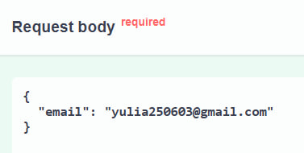

# ONLINE CINEMA
_____

## OVERVIEW
Welcome to **Online Cinema** – your ultimate destination for movies and video content! 
Dive into a world of entertainment where you can **explore, watch, and purchase** your favorite films anytime, anywhere. 
With a **vast library**, a **personalized experience**, and an **intuitive interface**, your perfect movie night is just a click away.  
_____
## [CHECK IT OUT](http://3.78.200.9:8000/docs)
_____
### 🛠 INSTALLATION 🛠

Before you begin, ensure you have the following:  
- ⚙️ **Python 3.12**  
- ⚙️ **Virtualenv** (optional but recommended for isolated environments)  
- ⚙️ **Poetry** (for dependency management)  
- ⚙️ **Alembic** (for database migrations)  
- ⚙️ **Gunicorn** (for running the server in production) 
_____
#### Steps to Install  

1. **Clone the repository**:  
   Run the following command to clone the project to your local machine:  
   ```bash
   git clone https://github.com/yulia-pl/online_cinema_fastapi/tree/dev
2. **Navigate to the project directory:**
    ```bash
   cd online_cinema_fastapi
3. **Install dependencies using Poetry:**
     ```bash
   poetry install
4. **Activate the virtual environment:**
    ```bash
   poetry shell
5. **Сreate a migration based on model changes:**
   ```bash 
   alembic revision --autogenerate
6. **Apply all migrations to bring the database up to date:**
   ```bash 
   alembic upgrade head

6. **Start the development server:**
    ```bash
   uvicorn app.main:app --reload

_____
## FEATURES  

### AUTHORIZATION AND AUTHENTICATION  

#### User Registration  
Sign up with your **email** and get an **activation link** (valid for **24 hours**). Missed the deadline? No worries – request a **new link** anytime. Your email stays **unique**, and we keep things secure by **automatically removing expired activation tokens**.


_____
#### Login and Logout  
Enjoy a seamless login with **JWT-based authentication**. Need a break? Simply **log out**, and your session is securely ended.  
_____
#### Password Management  
Forgot your password? No problem – request a **reset link** and set up a new one. If you remember your current password, changing it is quick and easy. And yes, we ensure **strong password security** for your protection.  




_____
#### JWT Token Management  
Stay logged in with a **secure pair of JWT tokens**. Your **refresh token** keeps access smooth while maintaining security with a **short-lived access token**.  
_____
#### User Roles  
Everyone has their role:  
- **User** – Enjoy movies and explore the platform.  
- **Moderator** – Manage content and track sales.  
- **Admin** – Oversee everything, from **user management** to **account activation**.  
### MOVIES  

#### User Features  
Explore our **huge movie catalog** and enjoy easy, fun features:  
- **Browse** movies, check out their **descriptions**, and **like, dislike, or comment** on them.  
- Use **filters and search** to find exactly what you’re in the mood for!  
- **Sort** movies by **price, release date**, or **popularity**—whatever you prefer.  
- Add movies to your **favorites** and keep them all in one place.  
- **Rate** movies on a **10-point scale** and see what others think.  
- **Genres** are super easy to explore—click and discover all the films in each category!  
_____
#### Moderator Features  
- **Manage** movies, genres, and actors effortlessly.  
- **Protect** movies that have been purchased from being deleted.  
_____
### SHOPPING CART  

#### User Features  
- **Add movies** to your cart as long as you haven't already bought them.  
- If you've **already purchased** a movie, you’ll get a friendly notification letting you know.  
- Easily **remove** movies from your cart if you change your mind.  
- View all the movies in your cart with **title, price, genre**, and **release year** displayed.  
- **Pay for everything** in your cart at once and get instant access to your movies.  
- After purchase, movies automatically move to your **"Purchased"** list.  
- You can also **clear your cart** completely whenever you want.  
_____
#### Validation  
- We’ll make sure all movies are **available for purchase** before you complete your order.  
- **Movies you've already bought** won’t be added again, and we’ll let you know.  
- Unregistered users will be asked to **sign up** before completing a purchase.  
- You can’t add the **same movie** to your cart twice.  
_____
#### Moderator Features  
- Admins can **view user carts** to help with analysis or troubleshooting.  
- Moderators will be notified if a movie is being **deleted** while it’s in someone’s cart.  
_____
### ORDER  

#### User Features  
- **Place orders** for movies in your cart with a few clicks.  
- If any movies are **unavailable** (e.g., deleted or region-locked), we’ll let you know, and they won’t be included in your order.  
- View all your past **orders**, with details like **date**, **total amount**, and **status** (paid, canceled, pending).  
- After confirming your order, you’ll be redirected to a **payment gateway**.  
- You can **cancel** orders before payment, but once paid, you’ll need to request a **refund** to cancel.  
- You’ll receive an **email confirmation** once the payment is successful.  
_____
#### Validation  
- Ensure your cart is **not empty** before placing an order.  
- Exclude movies **you’ve already purchased**.  
- Only **available movies** can be added to the order.  
- Prevent duplicate orders with the **same movies**.  
- We’ll double-check the total amount before payment in case of any **price changes**.  
_____
#### Moderator Features  
- Admins can **view user orders**, filterable by **user**, **date**, and **status** (paid, canceled, etc.).  
_____
### PAYMENTS  

#### User Features  
- **Pay securely** using **Stripe**.  
- After payment, you’ll get a **confirmation** both on the website and via email.  
- Easily track your payment history, including **date**, **amount**, and **status** (successful, canceled, refunded).  
_____
#### Validation  
- We’ll double-check the **total amount** of your order before processing.  
- Ensure your **payment method** is available and valid.  
- You must be **authenticated** to make a payment.  
- Transactions are validated via **webhooks** from the payment system.  
- Order status is updated only after **successful payment**.  
- If the payment is declined, we’ll suggest helpful tips, like **“Try a different payment method.”**  
_____
#### Moderator Features  
- Admins can **view all payments**, with filters for **users**, **dates**, and **statuses** (successful, refunded, canceled).  
_____